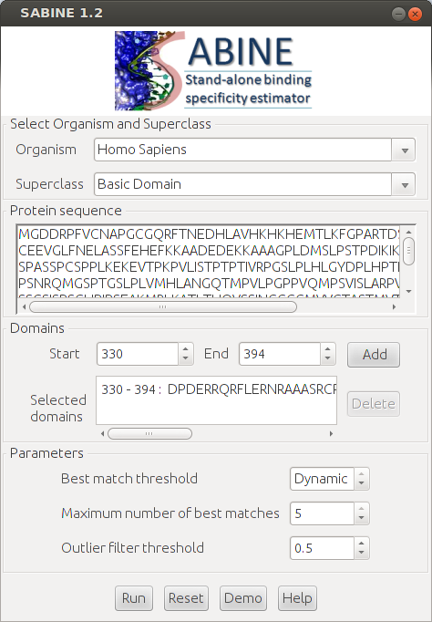

# SABINE


**StandAlone BINding specificity Estimator**

[](http://opensource.org/licenses/GPL-3.0)
[](https://github.com/draeger-lab/SABINE/releases/)
[](http://dx.doi.org/10.1371%2Fjournal.pone.0082238)

*Authors:* [Johannes Eichner](https://github.com/jeichner), [Adrian Schröder](http://www.cogsys.cs.uni-tuebingen.de/mitarb/schroeder/), [Andreas Dräger](https://github.com/draeger/), Jonas Eichner, [André Hennig](https://github.com/AndreHennig), Florian Topf, Dierk Wanke, [Klaus Harter](http://www.zmbp.uni-tuebingen.de/plant-physiol/research-groups/harter.html), [Andreas Zell](https://github.com/ZellTuebingen)

____________________________________________________________________________________________________________________________  

### Short description
SABINE is a tool to predict the binding specificity of a transcription factor (TF), given its amino acid sequence, species, structural superclass and DNA-binding domains. For convenience, the superclass and DNA-binding domains of a given TF can be predicted based on sequence homology with TFs in the training set of SABINE. Alternatively, the tool [TFpredict](https://github.com/draeger-lab/TFpredict), which predicts all structural characteristics of TFs required by SABINE, can be employed in an additional preprocessing step. SABINE compares a given factor to a predefined set of TFs of the same superclass for which experimentally confirmed position frequency matrices (PFM) are available. Based on various features capturing evolutionary, structural and physicochemical similarity of the DNA-binding domains, the PFM similarity is predicted utilizing support vector regression. The TFs with highest PFM similarity to the factor of interest is reported, and their PFMs are merged using STAMP to generate the predicted consensus PFM.

## Publications

Article citations are **critical** for us to be able to continue support for SABINE.  If you use SABINE and you publish papers about work that uses SABINE, we ask that you **please cite the SABINE papers**.

<dl>
  <dt>Original method paper:</dt>
  <dd>Adrian Schröder, Johannes Eichner, Jochen Supper, Jonas Eichner, Dierk Wanke, Carsten Henneges, and Andreas Zell. <a href="http://dx.doi.org/10.1371%2Fjournal.pone.0013876">Predicting DNA-Binding Specificities of Eukaryotic Transcription Factors</a>. PLoS ONE , 5(11):e13876, November 2010. [ <a href="http://dx.doi.org/10.1371%2Fjournal.pone.0013876">DOI</a> | <a href="http://journals.plos.org/plosone/article/file?id=10.1371/journal.pone.0013876&type=printable">PDF</a> ]</dd>
  <dt>Research Article:</dt>
  <dd>Johannes Eichner, Florian Topf, Andreas Dräger, Clemens Wrzodek, Dierk Wanke, and Andreas Zell. <a href="http://dx.doi.org/10.1371%2Fjournal.pone.0082238">TFpredict and SABINE: Sequence-Based Prediction of Structural and Functional Characteristics of Transcription Factors</a>. PLoS ONE, 8(12):e82238, December 2013.
  [ <a href="http://dx.doi.org/10.1371/journal.pone.0082238">DOI</a> | <a href="http://www.plosone.org/article/fetchObject.action?uri=info%3Adoi%2F10.1371%2Fjournal.pone.0082238&representation=PDF">PDF</a> ]  
  </dd>
</dl>

## Table of Contents:
  - [Installation](#installation)
  - [Manual](#manual)
  - [Format specification](#format-specification)
  - [License](#license)
  - [Integrated data](#integrated-data)
  - [Contact](#contact)
____________________________________________________________________________________________________________________________  

## Installation

To extract the gzipped tar archive of SABINE obtained from our [downloads](releases) section use the command:

    tar -xzf sabine.tar.gz

For convenience, a shell script was implemented to simplify the installation of SABINE. Start the installation script with the following command:

    sh install.sh

The script will install SABINE and all required [third-party software packages](#included-third-party-software) and libraries on your system. To test if the program is working properly, you can validate your installation using the command:

    sh sabine.sh -check-install

**Note:** Please ensure that the tcsh shell is installed on your system, as it is required by the tool `PSIPRED`, which is employed by SABINE to predict secondary structures.

### System requirements

* Linux system
* Java (JDK 1.6 or later)

SABINE exclusively runs on Linux as it integrates diverse bioinformatics tools (see [integrated software](#included-third-party-software)) which require a Linux platform. The analysis framework of SABINE is written in Java&trade;. Thus it requires that Java Virtual Machine (JDK version 1.6 or newer) is installed on your system. We recommend to use Sun Java 1.6 which has proven to perform well. 

## Manual

**DESCRIPTION:**
The tool predicts the binding specificity of a transcription factor (TF) in terms of a position frequency matrix (PFM), given the amino acid sequence, DNA-binding domains, superclass and species of the TF of interest.
              
The given factor (query factor) is compared to factors of the same superclass (training factors) for which experimentally determined PFMs are available. Based on diverse alignment- and kernel-based similarity measures comparing the DNA-binding domains of the query factor and the training factors, the PFM-similarity of each training factor to the query factor is estimated using a support-vector-machine-based regression model. 
              
The tool reports a set of best matches, i.e., training factors for which a PFM-similarity greater than a predefined similarity threshold (see OPTIONS: `-s`) was predicted. The PFMs of those best matches are in turn filtered to remove outliers (see OPTIONS: `-o`) and then merged using `STAMP` to generate the predicted PFM. The maximal number of PFMs that shall be merged can be specified by the user (see OPTIONS: `-m`). 

**INPUT:**    SABINE input file contains the query factors in the SABINE input file format (see SABINE Format Specification)

**OUTPUT:**   SABINE output file
* contains the predicted best matches and PFMs
* the output filename can be specified by the user (see **OPTIONS:** `-f`)

**USAGE:**

    sabine.sh <input_filename> [OPTIONS]

**OPTIONS:**

| Option                     | Meaning                                  | Default Value                    |
|----------------------------|------------------------------------------|----------------------------------|
|`-s <similarity_threshold>` | min. FBP-similarity of best matches      | `default = 0.95`                 |
|`-m <max_num_best_matches>` | max. number of best matches              | `default = 5`                    |
|`-o <outlier_filter_param>` | max. deviation of a single best match    | `default = 0.5`                  |
| `-b <base_dir>`            | directory that contains temporary files  |                                  |
|`-f <output_filename>`      | file to save the results                 | `default = <input_filename>.out` |
|`-v <verbose_mode>`         | write status to standard output          | `default = y (yes)`              |

A more detailed description of the progam including usage examples can be found below in the [Users' Guide](#users-guide)

## Format specification

If you want to use the [command-line interface](#the-command-line-interface) of SABINE, you have to comply with the following file format guidelines. If you use the [graphical interface](#the-graphical-user-interface) instead, a properly formatted input file will be generated automatically.

To predict a PFM for a TF, SABINE needs information about the organism, superclass, protein sequence and DNA-binding domains of the respective factor. This information has to be formatted as specified in the [SABINE input file format description](#sabine-input-file). 

The output of SABINE is a text file containing the predicted best matches, their predicted PFM-similarity to the query factor, and the consensus PFM which results from the merging the annotated PFMs of the best matches (see [SABINE output file format specification](#sabine--output-file)).

Note, that SABINE can be applied exclusively to eucaryotic transcription factors (see [list of supported organisms](doc/organism_list.txt)). However, the organism does not have a significant impact on the predicted motif returned by SABINE. It is only considered in 1 of 30 features recognized by the support vector regression model, which is the core component of the SABINE algorithm. When analyzing an organism that is not covered by [this list](doc/organism_list.txt), it is recommended to choose the organism from the list that is most closely related to the organism of interest. The prediction model only considers a single feature (distance in phylogenetic tree), which accounts for the organism of input transcription factor and it is known that the contribution of this feature to the predicted outcome is relatively low compared to other features.

The superclass of the TF specified in the input file has to be denoted as a decimal classification number (see [TF Classification](http://www.gene-regulation.com/pub/databases/transfac/cl.html) in TRANSFAC). The following table itemizes the decimal classification numbers for the five possible superclasses:

| Superclass       | Decimal class. no. |
|------------------|--------------------|
| Basic domain     | `1.0.0.0.0`        |
| Zinc finger      | `2.0.0.0.0`        |
| Helix-turn-helix | `3.0.0.0.0`        |
| Beta scaffold    | `4.0.0.0.0`        |
| Other            | `0.0.0.0.0`        |

The input file format description specifies the input data for an individual TF. You can pack multiple TFs in one input file to sequentially process larger datasets with SABINE. In addition to the general description of the file formats, example input and output files for SABINE are provided.

### SABINE input file

```
NA  Identifier
XX
SP  Organism
XX
RF  Reference to UniProt (optional)
XX
CL  Classification (class acc. no. or decimal classification no. as in TRANSFAC)
XX
S1  Amino acid sequence
XX
S2  Alternative amino acid sequence (optional)
XX
FT  DNA-binding domain (domain ID   start position   end position)
XX
//
XX
```

Also see the [list of supported organisms](doc/organism_list.txt) and class acc. no. or decimal classification no. as in [TRANSFAC](http://www.gene-regulation.com/pub/databases/transfac/cl.html).

[View Example File](doc/example.input.txt)

### SABINE output file

```
NA  Identifier
XX
BM  Best match (transcription factor ID   PFM similarity score) 
XX
MA  A   C   G   T   rows:	positions within the aligned sequences
MA		  first column: position index
MA               columns: relative frequencies of A, C, G, T residues
MA           last column: consensus sequence in IUPAC code
XX
//
XX
```

Also see the [IUPAC code](http://www.gene-regulation.com/pub/databases/transfac/doc/site1.html) for reference.

[View Example File](doc/example.output.txt)

## License


This program is free software; you can redistribute it and/or modify it under the terms of the GNU General Public License as published by the Free Software Foundation; either version 3 of the License, or (at your option) any later version.

This program is distributed in the hope that it will be useful, but WITHOUT ANY WARRANTY; without even the implied warranty of MERCHANTABILITY or FITNESS FOR A PARTICULAR PURPOSE. See the GNU General Public License for more details.

You should have received a copy of the GNU General Public License along with this program; if not, see <http://www.gnu.org/licenses/>.

### Included third-party software

* The Local Alignment Kernel by Hiroto Saigo et al. was integrated in SABINE as a sequence feature to measure the similarity of the DNA-binding domains. Website: http://sunflower.kuicr.kyoto-u.ac.jp/~hiroto/project/homology.html
* We included the Mismatch Kernel by Christina Leslie et al. as an additional feature which incorporates the domain similarity of transcription factors. Website: http://cbio.mskcc.org/leslielab/software/string-kernels
* To capture the structural similarity of TF binding domains we applied the PSIPRED secondary structure prediction method by David Jones *et al.* Website: http://bioinf.cs.ucl.ac.uk/psipred/
* We integrated the Motif statistic software suite (MoSta) by Utz Pape *et al.* to measure the similarity of PFMs. Website: http://mosta.molgen.mpg.de/
* In order to generate familial binding profiles by merging PFMs, we applied the tool STAMP by Shaun Mahony *et al.* Website: http://www.benoslab.pitt.edu/stamp/
* For training and evaluation of the support vector regression models we used the libSVM implementation provided by Chih-Chung Chang *et al.* Website: http://www.csie.ntu.edu.tw/~cjlin/libsvm/
* We computed pairwise sequence alignment scores and generated sequence logos using the open source framework BioJava by Richard Holland *et al.* Website: http://biojava.org/wiki/Main_Page

### Integrated data

The basis of our supervised machine learning based approach to predicting DNA-binding specificities of TFs was the generation of a non-redundant training data set. We restricted the sources to databases providing experimentally validated DNA-binding specificity information in terms of DNA-binding sites, consensus sequences or PFMs. Besides intergrating large databases spanning the whole eucaryotic kingdom, we extracted data from diverse smaller databases whose content is specific to particular organisms. An overview of our data sources can be found in the table below.

| Database  | URL                                                              |
|-----------|------------------------------------------------------------------|
| TRANSFAC  | http://www.biobase-international.com/pages/index.php?id=transfac |
| JASPAR    | http://jaspar.cgb.ki.se/                                         |
| YEASTRACT | http://www.yeastract.com/                                        |
| SCPD      | http://rulai.cshl.edu/SCPD/                                      |
| AGRIS     | http://arabidopsis.med.ohio-state.edu/                           |
| FLYREG    | http://www.flyreg.org/                                           |

## Users' Guide

### Introduction

The key features of gene-regulatory networks are the interconnections between specific transcription factors (TF) and cis-regulatory elements of the DNA. These connections function as an interface between signaling pathways and the regulation of gene expression. After decades of intensive research effort only a small fraction of these connections is known. A major and labour-intensive part of this effort is the characterization of the DNA-binding specificity of TFs whose DNA-binding domain enables the specific recognition of short DNA motives in the promoter region of their proximal target genes.

The stand-alone application SABINE predicts the binding specificity of eucaryotic transcription factors (TF), based on various features extracted from their annotated protein sequences. The predicted DNA motif is reported as a position frequency matrix (PFM) which is a commonly used format to represent transcription factor binding specificities. In a nutshell, SABINE adopts support vector regression (SVR) models to identify TFs with annotated PFMs that exhibit highly similar binding specificities as the factor of your interest. The PFMs of these functionally similar factors are filtered for outliers and subsequently merged to generate a consensus PFM which is in turn transferred to the factor under study.

To further increase our knowledge about the specific interactions between TFs and cis-regulatory elements, we designed an algorithm which allows for predicting the binding specificity of transcription factors with high accuracy. Apparently, the protein sequence and structure of the DNA-binding domain determines its function, which is the molecular recognition and binding to a defined set of DNA motives. Thus we approach to estimate the binding specificity of TFs based on structural, physicochemical and properties of their DNA-binding domains. Employing support vector regression we estimate the similarity of the binding specificities of two TFs based on diverse features incorporating domain sequence similarity, secondary structure and phylogenetic distance. This approach provides a quantitative measure for the functional similarity of two factors and enables the transfer of DNA-binding specificity data with low error.

### Example screenshots


### How to get started?

SABINE is available as a stand-alone version under releases. After [installing](#installation) the tool on your system, you can test whether the tool works properly by invoking SABINE with a sample command. Then you should choose the convenient user interface depending on your purpose of use of this program. SABINE is equipped with a user-friendly graphical interface which allows biological scientists to predict binding specificities of individual transcription factors. For time-consuming applications, such as organism-wide large-scale analysis of TF binding specificities, a more comprehensive [command-line interface](#the-command-line-interface) is provided.

### Starting the program

SABINE provides a Graphical User Interface (GUI) as well as a [command-line interface](#the-command-line-interface). You can use the GUI for predicting the binding specificities of individual TFs. For the purpose of applying SABINE to large datasets, we recommend using the command-line interface.

#### The graphical user interface

You can start the GUI by executing the main script in your installation directory with the option `--gui`.

    sh sabine.sh --gui

You will then see the following window:



##### The demo mode

Use the Demo-Button to generate a showcase input for SABINE. Click the Run-Button in order to predict the binding specificity of the exemplary transcription factor using the default parameters.

##### User-defined queries

Follow the steps listed below, if you want to use SABINE to predict the binding specificity of an individual transcription factor:

1. Choose the organism and the superclass of the transcription factor of your interest. The corresponding superclass can be looked up at [TRANSFAC](http://www.gene-regulation.com/pub/databases/transfac/cl.html).
2. Paste or type the entire amino acid sequence (in single-letter code) into the corresponding text box.
3. Specify the start and end positions of the DNA-binding domain(s) of the factor and press the Add-Button.
4. Click the Run-Button to predict the binding specificity of the entered transcription factor.

##### The results view

After SABINE has completely processed your input, the results will be displayed in a new frame.

If a PFM transfer was possible, the best matches, i.e., the TFs for which a PFM similarity greater than the [best match threshold](#best-batch-threshold) was predicted, are listed in a table. SABINE will display the corresponding consensus PFM in a table along with a sequence logo to provide a graphical representation of the transferred PFM. An option to save the reported results is available.

If SABINE was not able to transfer a PFM, you can try to choose a less stringent [best match threshold](#best-batch-threshold). If your query factor exhibits sufficient domain similarity to the training factors of SABINE, this will increase the chance that a PFM transfer is possible. Note, that decreasing the [best match threshold](#best-batch-threshold) might negatively affect the quality of the transferred PFM, as it reduces the significance of the best matches.


#### The command-line interface

To run SABINE in batch mode, execute the shell script sabine.sh contained in your installation directory:

    sh sabine.sh <input_filename> [<OPTIONS>]

To display the usage of the script and an overview of the command line options, use the command:

    sh sabine.sh --help

##### Short tutorial

This tutorial describes how SABINE can be applied to predict the binding specificity of the transcription factor of your interest.

First, you have to generate a properly formatted input file (see [format specification](#sabine-input-file) or [example input file](doc/example.input.txt)).
The input file should contain the following information about the transcription factor under study:
* Name or identifier
* Organism (see [list of supported organisms](doc/organism_list.txt))
* Superclass (can be obtained from [TRANSFAC](http://www.gene-regulation.com/pub/databases/transfac/cl.html))
* Protein sequence
* DNA-binding domains

In the next step one can apply the tool to predict the PFM-similarity of the chosen "query factor" to all "training factors" of the same TRANSFAC superclass whose PFMs are known, and which are part of the SABINE training set. The PFM predicted for your query factor results from merging the annotated PFMs of the best matches, i.e., the factors in the training set for which a high PFM-similarity to the query factor was predicted.
You can set a [threshold for the PFM similarity](#best-batch-threshold), which determines whether a training factor is counted as a best match and thereby constitutes a candidate for a PFM transfer to the query factor. Additionally, you can set a limit for the [maximum number of best match matrices](#maximum-number-of-best-matches) that shall be merged in order to generate the predicted PFM.

To run SABINE on the [example input file](doc/example.input.txt), using a PFM similarity threshold of 0.9 and merging at most 3 best match PFMs you can use the command:

    sh sabine.sh input/test.tf -s 0.9 -m 3

SABINE will return an output file (see [format specification](#sabine-output-file) or [example output file](doc/example.output.txt)), which contains the best matches associated with a PFM similarity score and the transferred PFM, provided that a best match was found in the training set.

##### Command-line options

You can set the [parameters](#parameters), customize the output and specify path and file names using the command-line options of SABINE which are listed in the following.

| Argument                           | Effect                                                                                             |
|------------------------------------|----------------------------------------------------------------------------------------------------|
| `-s <best match threshold>`        | Lower bound for the predicted PFM similarity of a best match (see [parameters](#parameters) for details).         |
| `-m <max. number of best matches>` | Limit for the number of PFMs that are merged to generate a prediction (see [parameters](#parameters) for details) |
| `-o <outlier filter threshold>`    | Maximal tolerated deviation of a best match PFM (see [parameters](#parameters) for details).                      |
| `-b <base directory>`              | Directory to save temporary files. If the option is omitted, the files are saved to an automatically generated base directory. |
| `-f <output filename>`             | Output file which contains predicted best matches and transferred PFM.                             |
| `-v <verbose option>`              | Enables/disables the standard output of SABINE.                                                    |

##### Parameters

The quality of the predicted PFMs heavily depends on the parameter settings of SABINE. Thus, we recommend to retain the stringent default values, which have proven to produce highly accurate results.

###### Best Match Threshold

This parameter defines a lower bound for the predicted PFM similarity of a best match to the query factor. By default this parameter is chosen dynamically at runtime depending on the quality of the best matches. However, if desired it can also be set to a fixed value. The more stringent the threshold value is chosen, the higher is the prediction accuracy, i.e., the expected correspondence between the transferred and the true PFM of the query factor. Choosing a less stringent cutoff increases the chance that a PFM transfer is possible, but also reduces the expected quality of the prediction.

###### Maximum Number of Best Matches

This parameter can be used to specify a limit for the number of PFMs which shall be merged to generate a prediction for the query factor. By default the PFMs of at most 5 best matches are merged to generate the predicted consensus PFM. If you want to avoid merging PFMs, you can set this parameter to 1. This setting will cause SABINE to directly transfer the PFM of the best match which has been predicted with highest confidence.

###### Outlier Filter Threshold

This parameter serves to adjust the stringency of the outlier filter, which avoids the merging of dissimilar PFMs (default: 0.5). The lower the cutoff is chosen, the more stringent is the criterion for exclusion and the higher is the homogeneity of the PFMs which are merged to generate a prediction.


## Contact

If you have any further questions, please contact [Johannes Eichner](https://github.com/jeichner).
